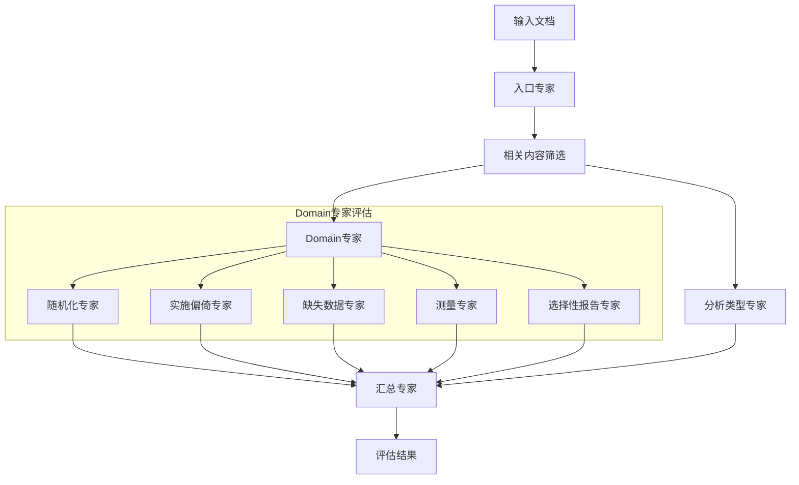
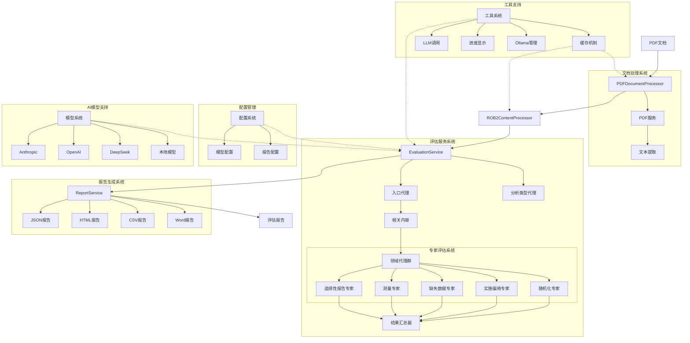

# ROB2 Evaluator

基于多专家混合代理的RCT研究偏倚风险评估工具 (ROB2)。

## 架构设计

### 简单



### 系统架构详图



### 模块说明

1. **文档处理系统**

   - PDFDocumentProcessor：PDF文档处理
   - ROB2ContentProcessor：内容提取与处理
   - PDFService：文本提取服务
2. **评估服务系统**

   - 入口代理：文献相关性筛选
   - 分析类型代理：评估路径判断
   - 专家评估系统：五大领域评估
   - 结果汇总器：综合分析
3. **报告生成系统**

   - 支持多种格式输出
   - 可视化报告生成
   - 结构化数据输出
4. **配置管理**

   - 模型配置：AI模型参数设置
   - 报告配置：输出格式定制
5. **工具支持**

   - 缓存机制：优化性能
   - LLM调用：模型接口封装
   - 进度显示：实时状态追踪
   - Ollama管理：本地模型部署
6. **AI模型支持**

   - 支持多种主流模型
   - 本地部署能力
   - 灵活的模型选择

## 新功能亮点

### 质量审查系统

系统集成了智能质量审查机制，对每个Domain的评估结果进行二次审查：

- **双重质控**：每个Domain评估结果都会经过专门的审查代理检验
- **标准化审查**：基于ROB2框架的专业审查标准
- **自动修正**：检测到问题时自动提供修正建议
- **审查追踪**：记录审查过程和修正原因

### 高性能并发处理

- **多线程评估**：Domain代理并发执行，显著提升处理速度
- **智能缓存**：基于内容哈希的缓存机制，避免重复处理
- **批量处理**：支持多个PDF文件的批量评估
- **进度追踪**：实时显示评估进度和状态

### 丰富的报告格式

支持多种专业报告格式：

- **HTML报告**：可视化交互式报告，支持汇总视图
- **JSON数据**：结构化数据，便于程序化处理
- **CSV表格**：表格化数据，便于统计分析
- **Word文档**：正式文档格式，支持打印和分享

## 安装与使用

### 环境要求

- Python 3.9+
- Poetry (推荐) 或 pip

### 快速安装

```bash
# 克隆项目
git clone <repository-url>
cd rob2-evaluator

# 使用Poetry安装
poetry install

# 或使用pip安装
pip install -e .
```

### 基本使用

```bash
# 使用Poetry运行
poetry run rob2-eval

# 直接运行
python rob2_evaluator/main.py

# 指定输入文件
python rob2_evaluator/main.py input.pdf

# 批量处理
python rob2_evaluator/main.py *.pdf
```

### 配置选项

系统支持多种AI模型提供商：

- Anthropic Claude
- OpenAI GPT
- DeepSeek
- Google Gemini  
- Groq
- 本地Ollama模型

通过环境变量或配置文件设置模型和API密钥。

## 开发与测试

```bash
# 运行测试
poetry run pytest

# 代码格式化
poetry run black .
poetry run isort .

# 代码检查
poetry run flake8
```

## 技术特性

- 🚀 **高性能**：多线程并发处理，智能缓存优化
- 🔍 **高质量**：双重质控机制，确保评估准确性
- 📊 **多格式**：支持HTML、JSON、CSV、Word等多种报告格式
- 🌐 **多模型**：支持主流AI模型提供商和本地部署
- 🔧 **可扩展**：模块化设计，易于扩展新功能
- 📝 **专业性**：基于ROB2国际标准，确保评估权威性

## 贡献

欢迎提交Issue和Pull Request来改进项目。

## 许可证

详见LICENSE文件。
