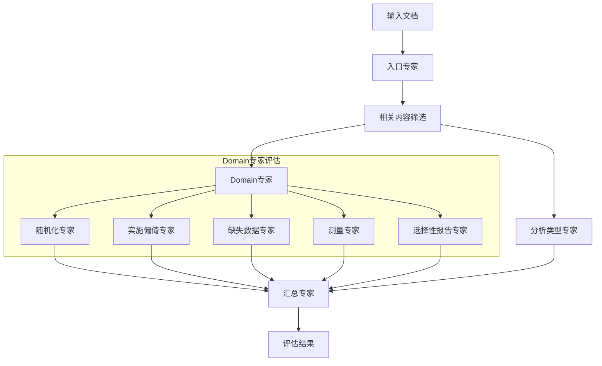

# ROB2 Evaluator

基于多专家混合代理的RCT研究偏倚风险评估工具 (ROB2)。

## 架构设计



## 使用示例

``` py
from rob2_evaluator.agents.aggregator import Aggregator
from rob2_evaluator.agents.domain_randomization import DomainRandomizationAgent
from rob2_evaluator.agents.analysis_type_agent import AnalysisTypeAgent
from rob2_evaluator.utils.json_io import load_json
import logging
import json


def process_single_file(input_path):
    content_list = load_json(input_path)

    # # 入口专家过滤
    # entry_agent = EntryAgent()
    # relevant_items = entry_agent.filter_relevant(content_list)
    relevant_items = content_list
    # 自动推断Domain 2分析类型
    analysis_type_agent = AnalysisTypeAgent()
    analysis_type = analysis_type_agent.infer_analysis_type(relevant_items)
    logging.info(f"Inferred Domain 2 analysis type: {analysis_type}")

    # Domain专家评估
    domain_agents = [
        DomainRandomizationAgent(),
        # Domain 2使用统一的专家，指定分析类型
        # DomainDeviationAgent(),
        # DomainMissingDataAgent(),
        # DomainMeasurementAgent(),
        # DomainSelectionAgent(),
    ]
    domain_results = [agent.evaluate(relevant_items) for agent in domain_agents]

    # 汇总专家评估
    aggregator = Aggregator()
    overall_result = aggregator.evaluate(domain_results)

    # 将汇总结果添加到扁平化的结果数组中
    domain_results.append(overall_result)

    return domain_results


if __name__ == "__main__":
    result = process_single_file("examples/content_list.json")

    print(json.dumps(result, indent=4, ensure_ascii=False))
```
