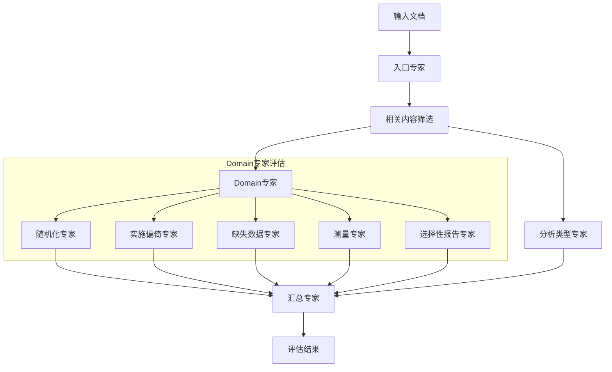
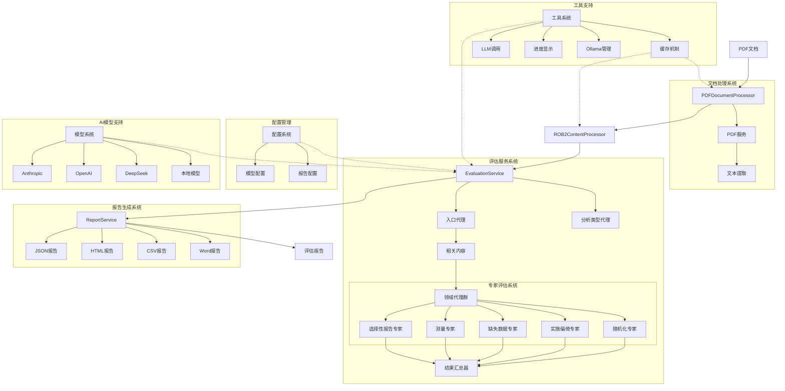

# ROB2 Evaluator

基于多专家混合代理的RCT研究偏倚风险评估工具 (ROB2)。

## 架构设计

### 简单



### 系统架构详图



### 模块说明

1. **文档处理系统**

   - PDFDocumentProcessor：PDF文档处理
   - ROB2ContentProcessor：内容提取与处理
   - PDFService：文本提取服务
2. **评估服务系统**

   - 入口代理：文献相关性筛选
   - 分析类型代理：评估路径判断
   - 专家评估系统：五大领域评估
   - 结果汇总器：综合分析
3. **报告生成系统**

   - 支持多种格式输出
   - 可视化报告生成
   - 结构化数据输出
4. **配置管理**

   - 模型配置：AI模型参数设置
   - 报告配置：输出格式定制
5. **工具支持**

   - 缓存机制：优化性能
   - LLM调用：模型接口封装
   - 进度显示：实时状态追踪
   - Ollama管理：本地模型部署
6. **AI模型支持**

   - 支持多种主流模型
   - 本地部署能力
   - 灵活的模型选择

````

````
