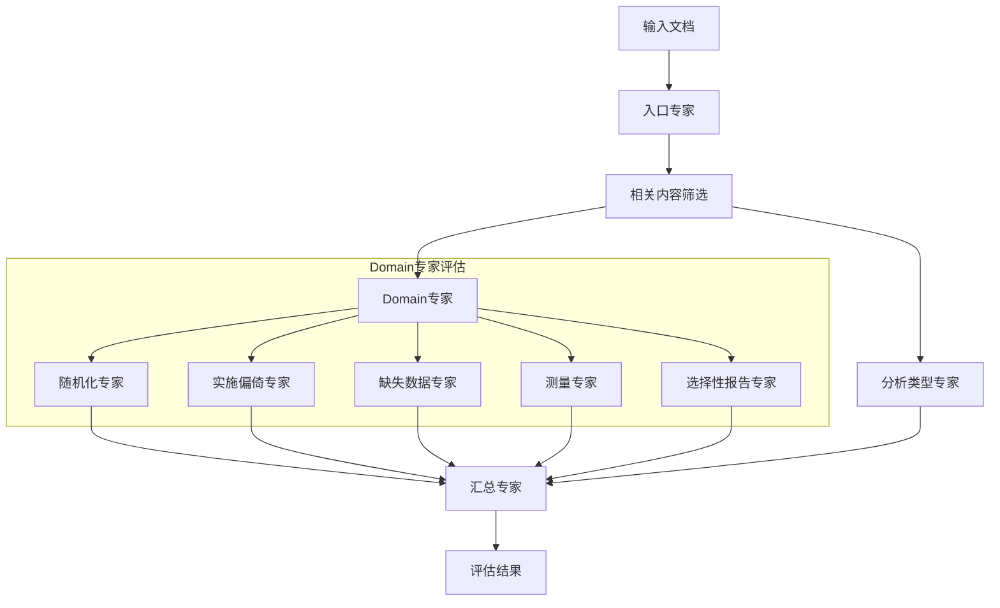

# ROB2 Evaluator

基于多专家混合代理的RCT研究偏倚风险评估工具 (ROB2)。

## 架构设计

```mermaid
graph TD
    A[输入文档] --> B[入口专家]
    B --> C[相关内容筛选]
    C --> D[分析类型专家]
    C --> E[Domain专家]
    
    subgraph "Domain专家评估"
        E --> F1[随机化专家]
        E --> F2[实施偏倚专家]
        E --> F3[缺失数据专家]
        E --> F4[测量专家]
        E --> F5[选择性报告专家]
    end
    
    F1 --> G[汇总专家]
    F2 --> G
    F3 --> G
    F4 --> G
    F5 --> G
    D --> G
    
    G --> H[评估结果]
```
